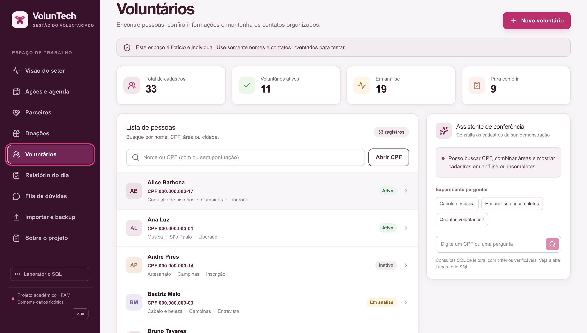
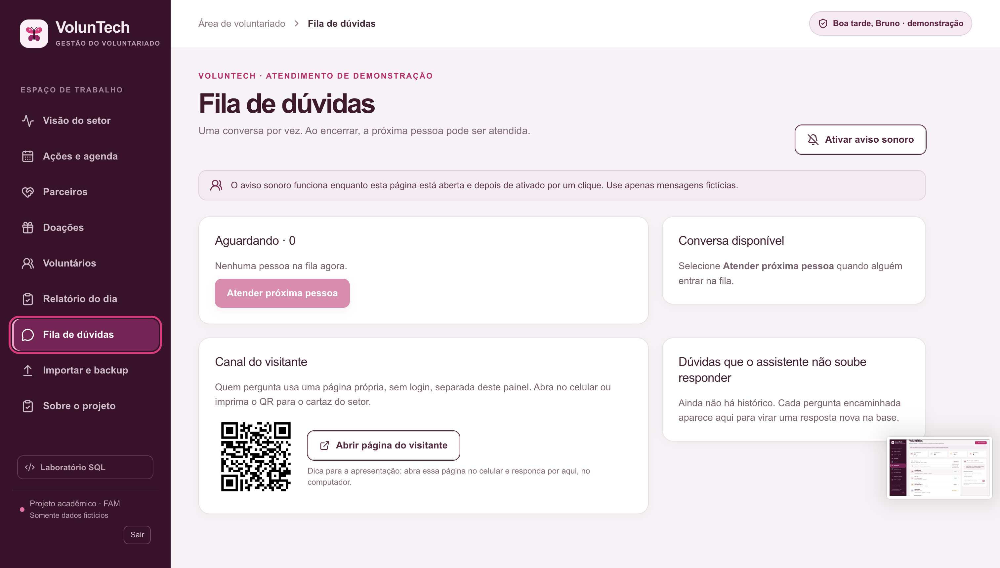
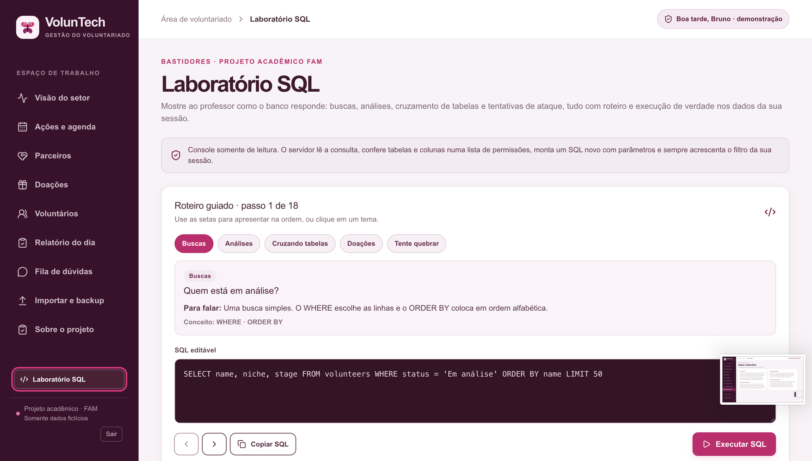

# VolunTech-FAM

**Sistema acadêmico de gestão de voluntariado desenvolvido para a FAM.**

O **VolunTech** é uma aplicação desktop desenvolvida como projeto acadêmico para demonstrar uma solução de gestão de voluntariado, instituições, doações, voluntários, agenda, comunicação e recursos relacionados.

> **Importante:** este projeto possui finalidade acadêmica e demonstrativa. Os dados utilizados são fictícios e o sistema não deve ser utilizado para administrar dados reais de pacientes, hospitais ou outras informações sensíveis.

**Versão atual: `v1.0.3`**

---

## Navegação

* [Download](#download)
* [Conheça o VolunTech](#conheça-o-voluntech)
* [Funcionalidades](#o-que-o-voluntech-oferece)
* [Demonstração](#demonstração)
* [Documentação](#documentação)
* [Tecnologias](#tecnologias)
* [Desenvolvimento](#desenvolvimento)
* [Arquitetura](#arquitetura)
* [GitHub Actions](#github-actions)
* [Histórico de versões](#histórico-de-versões)
* [Limites da demonstração](#limites-da-demonstração)

---

# Download

A versão mais recente do VolunTech é a **v1.0.3**.

Os instaladores oficiais são publicados na página de Releases do projeto.

## Windows

Baixe:

```text
VolunTech-Setup-1.0.3.exe
```

## macOS

| Computador                          | Instalador                  |
| ----------------------------------- | --------------------------- |
| Apple Silicon — M1, M2, M3, M4 etc. | `VolunTech-1.0.3-arm64.dmg` |
| Intel                               | `VolunTech-1.0.3-x64.dmg`   |

### Qual versão do Mac devo utilizar?

No macOS, acesse:

** → Sobre Este Mac**

* Se aparecer **Chip Apple**, utilize a versão `arm64`.
* Se aparecer **Intel**, utilize a versão `x64`.

### macOS — primeira execução

Esta é uma versão acadêmica do VolunTech distribuída sem assinatura e notarização Apple. Por isso, o macOS pode bloquear a primeira abertura do aplicativo após o download.

Depois de abrir o arquivo `.dmg` e arrastar o **VolunTech** para a pasta **Aplicativos**, se o macOS informar que o aplicativo está danificado ou não pode ser aberto, execute no Terminal:

```bash
xattr -dr com.apple.quarantine "/Applications/VolunTech.app"
```

Depois, abra novamente o **VolunTech** pela pasta **Aplicativos**.

Esse comando remove a marca de quarentena aplicada pelo macOS ao aplicativo baixado. Ele **não assina nem notariza o aplicativo** e não substitui a assinatura/notarização oficial da Apple.

Se o aplicativo estiver instalado em outro local, ajuste o caminho no comando.
### Releases

**[Acessar os instaladores do VolunTech](https://github.com/bruno-dsn/VolunTech-FAM/releases)**

> **Importante:** os arquivos `.zip` e `.tar.gz` identificados como `Source code` são códigos-fonte gerados pelo GitHub. Eles não são os instaladores do aplicativo.

---

# Conheça o VolunTech

Abaixo estão algumas das principais telas da aplicação.








---

# O que o VolunTech oferece?

A demonstração reúne diferentes recursos relacionados à gestão de voluntariado e às atividades de uma instituição.

| Recurso                      | Descrição                                             |
| ---------------------------- | ----------------------------------------------------- |
| **Visão do setor**           | Visualização geral das informações do setor           |
| **Ações e agenda**           | Organização de atividades e compromissos              |
| **Instituições e parceiros** | Informações relacionadas às instituições e parceiros  |
| **Doações**                  | Gerenciamento e visualização de doações               |
| **Voluntários**              | Cadastro e acompanhamento dos voluntários             |
| **Atualizações de hoje**     | Visualização de atualizações recentes                 |
| **Fila de dúvidas**          | Organização das dúvidas recebidas                     |
| **Canal do visitante**       | Recursos destinados à interação com visitantes        |
| **Laboratório SQL**          | Ambiente demonstrativo para consultas e conceitos SQL |
| **Importar e backup**        | Recursos relacionados a dados e cópias de segurança   |
| **Sobre o projeto**          | Informações gerais sobre o VolunTech                  |

---

# Demonstração

## Login

Para acessar a demonstração:

* Nome: qualquer nome com pelo menos 2 letras
* Senha:

```text
VolunTech2026!
```

> **Atenção:** essa senha é pública e faz parte da demonstração acadêmica. Não utilize o sistema de demonstração para armazenar informações reais ou confidenciais.

---

## QR Code e acesso pela rede local

O VolunTech possui recursos relacionados à descoberta e utilização da aplicação através da rede local.

Entre os caminhos utilizados pelo sistema estão:

```text
/duvidas
/gesto
/api/chat
```

O funcionamento depende da configuração da rede local e do ambiente em que a aplicação está sendo executada.

Para utilizar recursos de acesso pela rede:

1. Os dispositivos devem estar conectados à mesma rede.
2. O computador que executa o VolunTech precisa permitir a comunicação através do firewall, quando necessário.
3. O endereço utilizado deve corresponder ao endereço de rede disponível no ambiente.

> Os recursos de rede fazem parte da demonstração acadêmica e não devem ser considerados uma infraestrutura de produção.

---

# Documentação

A documentação complementar está disponível na pasta:

```text
DOCUMENTACAO/
```

Ela contém materiais relacionados ao projeto, incluindo:

* documentação geral;
* história e visão do projeto;
* documentação técnica;
* documentação do banco de dados;
* modelo de dados;
* DER;
* materiais acadêmicos e de apoio.

Também está disponível:

```text
DOCUMENTACAO/VolunTech-Historia-e-Visao-Geral.pdf
```

---

# Tecnologias

O projeto utiliza diferentes tecnologias para a construção da aplicação web, desktop, backend e banco de dados.

| Área                         | Tecnologias                   |
| ---------------------------- | ----------------------------- |
| **Interface**                | React, TypeScript             |
| **Aplicação**                | Next.js / Vinext, Vite        |
| **Desktop**                  | Electron                      |
| **Runtime / Backend**        | Cloudflare Workers, Miniflare |
| **Banco de dados**           | SQLite, Cloudflare D1         |
| **ORM**                      | Drizzle ORM                   |
| **Gerenciamento de pacotes** | pnpm                          |
| **Controle de versão**       | Git, GitHub                   |
| **Automação**                | GitHub Actions                |

---

# IA no desenvolvimento

Ferramentas de inteligência artificial foram utilizadas como apoio durante o desenvolvimento do projeto.

Entre os usos estão:

* programação;
* análise de código;
* documentação;
* identificação de problemas;
* sugestões de implementação;
* revisão de componentes;
* organização do projeto;
* desenvolvimento e manutenção.

A utilização de IA como ferramenta de apoio não significa que todas as técnicas de inteligência artificial façam parte da aplicação.

> **Observação:** RAG não está implementado nesta versão do VolunTech.

---

# Desenvolvimento

## Requisitos

Para executar o projeto em ambiente de desenvolvimento:

```text
Node.js >= 22.13.0
pnpm 11.25.0
```

---

## Instalar as dependências

Na raiz do projeto:

```bash
pnpm install
```

---

## Executar o VolunTech como aplicativo desktop

```bash
pnpm electron
```

Também é possível utilizar:

```bash
pnpm electron:dev
```

---

## Executar o servidor de desenvolvimento

```bash
pnpm dev
```

O fluxo atual utiliza o script:

```text
scripts/electron-server.mjs
```

O endpoint utilizado para comunicação de rede durante o desenvolvimento é:

```text
http://localhost:5173/api/network
```

> **Importante:** o fluxo atual de `pnpm dev` não deve ser substituído por um fluxo antigo de execução direta do framework. A versão atual contém correções relacionadas ao fluxo de QR Code e descoberta da rede.

---

# Scripts disponíveis

| Comando               | Função                                 |
| --------------------- | -------------------------------------- |
| `pnpm dev`            | Inicia o ambiente de desenvolvimento   |
| `pnpm build`          | Gera o build da aplicação              |
| `pnpm start`          | Inicia a aplicação em modo de produção |
| `pnpm electron`       | Executa a aplicação Electron           |
| `pnpm electron:dev`   | Executa o Electron em desenvolvimento  |
| `pnpm electron:build` | Gera o build do aplicativo desktop     |
| `pnpm lint`           | Executa as verificações de lint        |
| `pnpm db:generate`    | Gera artefatos relacionados ao banco   |
| `pnpm dist:win`       | Gera o instalador Windows              |
| `pnpm dist:mac`       | Gera o instalador macOS                |
| `pnpm dist`           | Gera os distribuíveis configurados     |

---

# Estrutura do projeto

A estrutura principal é semelhante a:

```text
VolunTech-FAM/

├── app/
├── components/
│   └── voluntech/
│
├── db/
├── drizzle/
├── lib/
├── public/
├── scripts/
├── build/
├── vendor/
│
├── DOCUMENTACAO/
├── Fotos/
│
├── main.js
├── package.json
├── pnpm-lock.yaml
├── vite.config.ts
├── drizzle.config.ts
├── CHANGELOG.md
└── README.md
```

---

# Arquitetura

## Electron

O VolunTech utiliza **Electron** para disponibilizar a aplicação como software desktop.

A arquitetura separa o processo da aplicação desktop do servidor interno utilizado pelo sistema.

O servidor interno possui seu próprio fluxo de inicialização e comunicação.

Além disso, o estado gravável utilizado durante a execução deve ficar fora dos arquivos empacotados da aplicação.

Os arquivos da aplicação e suas dependências são tratados separadamente do estado gravável de runtime.

Essa organização permite que o aplicativo instalado mantenha seus dados de execução sem depender de escrita dentro do conteúdo empacotado no ASAR.

---

## Banco de dados

O projeto utiliza:

* SQLite;
* Cloudflare D1;
* Drizzle ORM.

O schema principal está localizado em:

```text
db/schema.ts
```

As migrações ficam em:

```text
drizzle/
```

O Drizzle é utilizado para representar e manipular a estrutura do banco de dados.

---

## QR Code e variáveis de ambiente

O comportamento relacionado à rede pode ser configurado por variáveis de ambiente.

Entre elas:

```text
VOLUNTECH_LAN=0
```

```text
VOLUNTECH_PUBLIC_URL=https://...
```

```text
VOLUNTECH_PORT=5173
```

A porta padrão utilizada pelo sistema é:

```text
5173
```

---

# Gerar instaladores localmente

## Windows

```bash
pnpm dist:win
```

## macOS

```bash
pnpm dist:mac
```

## Distribuição configurada

```bash
pnpm dist
```

Os arquivos gerados ficam na pasta:

```text
release/
```

---

# GitHub Actions

O projeto possui GitHub Actions configurado para gerar os instaladores automaticamente.

O workflow responsável está localizado em:

```text
.github/workflows/build-desktop.yml
```

Quando uma nova tag de versão é publicada, o workflow pode gerar:

* instalador Windows;
* instalador macOS ARM64;
* instalador macOS Intel.

---

## Windows

O processo inclui:

* checkout do código;
* configuração do pnpm;
* configuração do Node.js;
* instalação das dependências;
* geração do instalador `.exe`;
* upload do artefato;
* publicação do instalador na Release.

---

## macOS

O processo utiliza duas arquiteturas:

```text
arm64
x64
```

São utilizados runners específicos para cada arquitetura.

Os arquivos `.dmg` são então enviados para a Release correspondente.

---

# Publicação de uma Release

O processo de publicação utiliza tags do Git.

Exemplo:

```bash
git tag v1.0.3
git push origin v1.0.3
```

A tag inicia o workflow de construção dos instaladores.

A versão `v1.0.3` já foi publicada neste projeto e possui os instaladores gerados pelo GitHub Actions.

### Instalações publicadas na v1.0.3

```text
VolunTech-Setup-1.0.3.exe
VolunTech-1.0.3-arm64.dmg
VolunTech-1.0.3-x64.dmg
```

---

# Executar o workflow manualmente

O workflow também pode ser executado manualmente pelo GitHub Actions.

No GitHub:

```text
Actions
→ Build desktop installers
→ Run workflow
```

Isso permite iniciar uma compilação manual sem necessariamente criar uma nova versão.

---

# Verificação

Depois de realizar alterações no projeto, alguns comandos úteis são:

### Verificar o estado do repositório

```bash
git status
```

### Verificar alterações

```bash
git diff
```

### Verificar problemas de whitespace

```bash
git diff --check
```

### Verificar commits

```bash
git log --oneline
```

### Verificar tags

```bash
git tag
```

### Verificar a versão do projeto

```bash
cat package.json
```

---

# Histórico de versões

## v1.0.3

Versão atual.

Inclui:

* atualização da versão do aplicativo;
* instalador Windows;
* instalador macOS ARM64;
* instalador macOS Intel;
* publicação automatizada através do GitHub Actions;
* atualização da documentação;
* README atualizado;
* organização das telas e documentação do projeto.

---

## v1.0.2

Versão que recebeu correções importantes relacionadas ao funcionamento do QR Code e à descoberta da rede local.

Também houve ajustes no fluxo de desenvolvimento e execução da aplicação.

---

## v1.0.1

Versão anterior utilizada durante o desenvolvimento acadêmico do projeto.

---

## v1.0.0

Primeira versão principal do VolunTech.

---

# Arquivos importantes

| Arquivo / Pasta      | Função                             |
| -------------------- | ---------------------------------- |
| `README.md`          | Documentação principal             |
| `package.json`       | Scripts, dependências e versão     |
| `pnpm-lock.yaml`     | Lockfile das dependências          |
| `main.js`            | Entrada principal do Electron      |
| `db/schema.ts`       | Schema do banco                    |
| `drizzle/`           | Migrações do banco                 |
| `scripts/`           | Scripts auxiliares                 |
| `DOCUMENTACAO/`      | Documentação técnica e acadêmica   |
| `Fotos/`             | Imagens utilizadas na documentação |
| `.github/workflows/` | Automação do GitHub Actions        |
| `vite.config.ts`     | Configuração do Vite               |
| `drizzle.config.ts`  | Configuração do Drizzle            |
| `CHANGELOG.md`       | Histórico de alterações            |

---

# Limites da demonstração

O VolunTech foi desenvolvido como projeto acadêmico e demonstrativo.

Portanto:

* os dados são fictícios;
* o sistema não deve receber dados reais de pacientes;
* não deve ser utilizado como sistema hospitalar;
* não deve ser utilizado como sistema de produção sem uma avaliação completa de segurança;
* os recursos de rede são destinados à demonstração;
* a senha de demonstração é pública;
* recursos de autenticação, segurança, infraestrutura, auditoria e proteção de dados não devem ser considerados equivalentes aos de um sistema corporativo de produção.

---

# Links

### Repositório

**https://github.com/bruno-dsn/VolunTech-FAM**

### Releases

**https://github.com/bruno-dsn/VolunTech-FAM/releases**

### Release atual — v1.0.3

**https://github.com/bruno-dsn/VolunTech-FAM/releases/tag/v1.0.3**

---

# VolunTech-FAM

**Projeto acadêmico — FAM**

Desenvolvido para fins educacionais, demonstrativos e de aprendizado.
