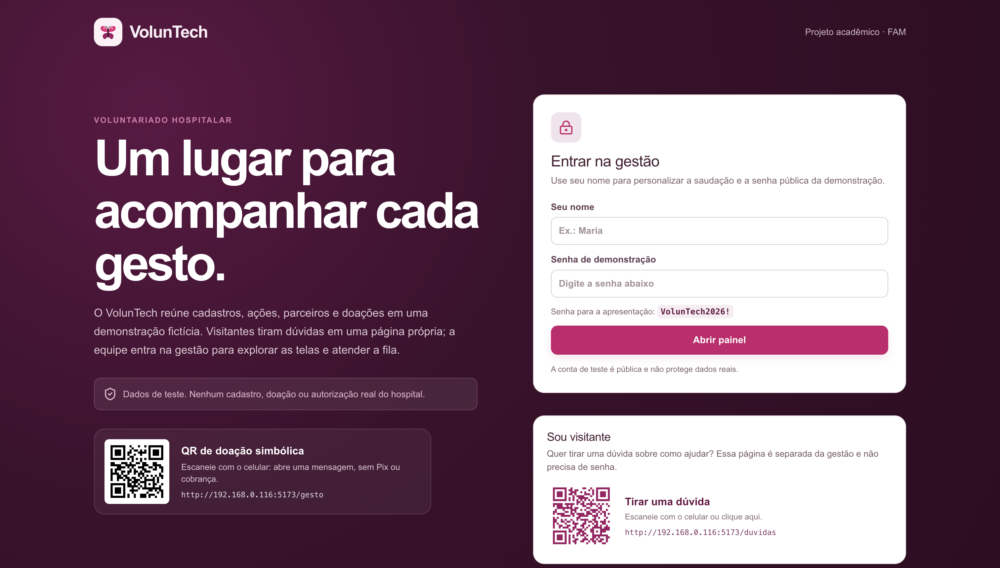
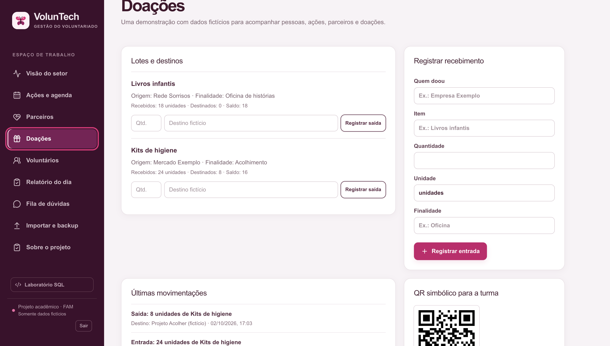

# VolunTech-FAM

**Sistema acadêmico de gestão de voluntariado desenvolvido para a FAM.**

O **VolunTech** é uma aplicação desktop desenvolvida como projeto acadêmico para demonstrar uma solução de gestão de voluntariado, instituições, doações, voluntários, agenda, comunicação e recursos relacionados.

> **Importante:** este projeto possui finalidade acadêmica e demonstrativa. Os dados utilizados são fictícios e o sistema não deve ser utilizado para administrar dados reais de pacientes, hospitais ou outras informações sensíveis.

**Versão atual: v1.0.3**

---

## Antes de começar

| Se você quer...                               | Vá para                                                  |
| --------------------------------------------- | -------------------------------------------------------- |
| Apenas instalar e usar                        | [Download](#download)                                    |
| Saber qual arquivo baixar                     | [Qual arquivo devo baixar?](#qual-arquivo-devo-baixar)   |
| Entender como o GitHub funciona neste projeto | [Release, Tag e Source code](#release-tag-e-source-code) |
| Conhecer as telas do sistema                  | [Conheça o VolunTech](#conheça-o-voluntech)              |
| Executar ou desenvolver o projeto             | [Desenvolvimento](#desenvolvimento)                      |

---

# Download

A versão mais recente disponível é a **v1.0.3**.

## Windows

Baixe o instalador:

**VolunTech-Setup-1.0.3.exe**

A versão mais recente pode ser encontrada na página de Releases do projeto.

## macOS

| Seu Mac                             | Arquivo                     |
| ----------------------------------- | --------------------------- |
| Apple Silicon — M1, M2, M3, M4 etc. | `VolunTech-1.0.3-arm64.dmg` |
| Intel                               | `VolunTech-1.0.3-x64.dmg`   |

> Se você possui um Mac com chip Apple Silicon, normalmente deve utilizar a versão **ARM64**.

Acesse a página de Releases para encontrar os instaladores:

**[Releases do VolunTech-FAM](https://github.com/bruno-dsn/VolunTech-FAM/releases)**

---

# Qual arquivo devo baixar?

A regra é simples:

### Windows

Baixe:

`VolunTech-Setup-1.0.3.exe`

### Mac com chip Apple

Baixe:

`VolunTech-1.0.3-arm64.dmg`

### Mac Intel

Baixe:

`VolunTech-1.0.3-x64.dmg`

### Como descobrir qual Mac você possui?

No macOS:

** → Sobre Este Mac**

Se aparecer **Chip Apple**, utilize ARM64.

Se aparecer **Processador Intel**, utilize x64.

---

# O que NÃO baixar

Na página da Release também aparecem arquivos como:

* `Source code (zip)`
* `Source code (tar.gz)`

Esses arquivos **não são os instaladores do VolunTech**.

Eles correspondem ao código-fonte do projeto disponibilizado automaticamente pelo GitHub.

Se você deseja apenas utilizar o sistema, **não precisa baixar esses arquivos**.

Use os instaladores:

* `.exe` para Windows
* `.dmg` para macOS

---

# Release, Tag e Source code

O projeto utiliza o sistema de versões do GitHub.

Por exemplo:

```text
v1.0.2
v1.0.3
```

Uma **Tag** identifica uma versão específica do código.

Uma **Release** é a publicação dessa versão no GitHub, normalmente acompanhada pelos arquivos instaladores.

A versão atual é:

```text
v1.0.3
```

Ela contém os instaladores oficiais gerados automaticamente pelo GitHub Actions.

Na página da Release você encontrará:

* instalador Windows;
* instalador macOS ARM64;
* instalador macOS Intel;
* código-fonte disponibilizado automaticamente pelo GitHub;
* hashes SHA-256 dos instaladores.

---

# Instalação no Windows

Depois de baixar:

```text
VolunTech-Setup-1.0.3.exe
```

execute o instalador normalmente.

Dependendo das configurações de segurança do Windows, o **Microsoft Defender SmartScreen** pode apresentar uma mensagem informando que o Windows protegeu o computador.

Isso pode acontecer porque o instalador é um aplicativo acadêmico distribuído diretamente pelo GitHub e não possui assinatura comercial reconhecida pelo Windows.

Caso isso aconteça:

1. Clique em **Mais informações**.
2. Verifique o nome do aplicativo.
3. Clique em **Executar assim mesmo**, caso você tenha baixado o instalador diretamente da Release oficial do projeto.

---

# Instalação no macOS

Baixe o `.dmg` correspondente ao seu Mac.

Depois:

1. Abra o arquivo `.dmg`.
2. Arraste o VolunTech para a pasta Applications/Aplicativos.
3. Abra o aplicativo.

Dependendo das configurações de segurança do macOS, pode ser necessário autorizar a abertura do aplicativo.

Caso seja necessário, consulte o arquivo:

```text
LEIA-ME-MAC.txt
```

disponibilizado junto ao projeto.

---

# QR Codes e acesso pela rede local

O VolunTech possui recursos de acesso pela rede local para algumas funcionalidades de demonstração.

Entre os caminhos utilizados estão:

```text
/duvidas
/gesto
/api/chat
```

Para utilizar esses recursos:

* o computador que executa o VolunTech deve estar funcionando;
* o dispositivo utilizado para acessar o QR Code deve estar na mesma rede Wi-Fi;
* o painel/login continua sendo executado localmente;
* o firewall do sistema pode solicitar autorização para comunicação na rede.

Se a rede for alterada, o endereço utilizado pelo QR Code também poderá mudar.

> **Importante:** os recursos de rede existem para demonstração acadêmica. O sistema não deve ser tratado como uma aplicação de produção ou como infraestrutura segura para dados reais.

---

# Login da demonstração

Para acessar a demonstração:

### Nome

Pode ser utilizado qualquer nome com pelo menos duas letras.

### Senha

```text
VolunTech2026!
```

> **Atenção:** essa senha é pública e faz parte da demonstração acadêmica. Não utilize o sistema de demonstração para armazenar informações reais ou confidenciais.

---

# Conheça o VolunTech

Abaixo estão algumas das telas principais da aplicação.

## 1. Tela inicial

A tela inicial apresenta a visão principal do sistema e os recursos disponíveis para navegação.



---

## 2. Visão do setor

A aplicação possui uma área destinada à visualização das informações relacionadas ao setor e às atividades de voluntariado.

---

## 3. Doações

Área destinada ao gerenciamento e visualização das informações relacionadas às doações.



---

## 4. Voluntários

Área destinada ao cadastro e acompanhamento dos voluntários.


---

## 5. Fila de dúvidas

A aplicação possui uma área para organização das dúvidas e solicitações recebidas.


---

## 6. Sobre o VolunTech

A aplicação também possui uma área de apresentação do projeto e de suas informações gerais.

---

## 7. Laboratório SQL

O projeto possui um laboratório destinado à demonstração de conceitos relacionados a banco de dados e SQL.


---

## 8. Respostas

A aplicação também possui recursos relacionados ao fluxo de respostas e comunicação.

---

# O que existe na demonstração?

| Recurso                      | Descrição                                             |
| ---------------------------- | ----------------------------------------------------- |
| **Visão do setor**           | Visualização geral das informações do setor           |
| **Ações e agenda**           | Organização de atividades e compromissos              |
| **Instituições e parceiros** | Informações relacionadas às instituições e parceiros  |
| **Doações**                  | Gerenciamento e visualização de doações               |
| **Voluntários**              | Cadastro e acompanhamento de voluntários              |
| **Atualizações de hoje**     | Visualização de atualizações recentes                 |
| **Fila de dúvidas**          | Organização das dúvidas recebidas                     |
| **Canal do visitante**       | Recursos destinados à interação com visitantes        |
| **Laboratório SQL**          | Ambiente demonstrativo para consultas e conceitos SQL |
| **Importar e backup**        | Recursos relacionados a dados e cópias de segurança   |
| **Sobre o projeto**          | Informações gerais sobre o VolunTech                  |

---

# IA no desenvolvimento

A Inteligência Artificial foi utilizada como ferramenta de apoio durante o desenvolvimento do projeto.

Ela foi utilizada principalmente como suporte para:

* programação;
* análise de código;
* documentação;
* identificação de problemas;
* sugestões de implementação;
* revisão de componentes;
* organização do projeto;
* desenvolvimento e manutenção.

> **Importante:** a utilização de IA como ferramenta de apoio ao desenvolvimento não significa que o sistema desta versão implemente necessariamente todas as técnicas de IA utilizadas durante o processo de desenvolvimento.

O projeto também possui conceitos relacionados a comunicação e integração com recursos de IA.

**RAG (Retrieval-Augmented Generation) não está implementado nesta versão.**

---

# Documentação

A documentação do projeto está disponível na pasta:

```text
DOCUMENTACAO/
```

Entre os materiais disponíveis estão:

* documentação geral;
* histórico do projeto;
* visão geral da aplicação;
* documentação do banco de dados;
* documentação técnica;
* modelo de dados;
* DER.

Também existe o documento:

```text
DOCUMENTACAO/VolunTech-Historia-e-Visao-Geral.pdf
```

Além disso, a documentação do banco de dados apresenta informações relacionadas ao schema e ao modelo utilizado pela aplicação.

---

# Desenvolvimento

## Stack utilizada

O projeto utiliza tecnologias modernas para desenvolvimento web, desktop e banco de dados.

### Front-end

* React
* TypeScript
* Next.js / Vinext
* Vite

### Desktop

* Electron

### Backend / Runtime

* Cloudflare Workers
* Miniflare

### Banco de dados

* SQLite
* Cloudflare D1
* Drizzle ORM

### Desenvolvimento

* Node.js
* pnpm
* Git
* GitHub
* GitHub Actions

---

# Requisitos

Para executar o projeto como desenvolvedor, recomenda-se:

```text
Node.js >= 22.13.0
pnpm 11.25.0
```

---

# Instalação das dependências

Na raiz do projeto:

```bash
pnpm install
```

---

# Executar o VolunTech como aplicativo desktop

Para iniciar o aplicativo Electron:

```bash
pnpm electron
```

Também existe o comando equivalente:

```bash
pnpm electron:dev
```

---

# Executar o servidor de desenvolvimento

Para iniciar o ambiente de desenvolvimento:

```bash
pnpm dev
```

O servidor é executado através do fluxo definido em:

```text
scripts/electron-server.mjs
```

O endpoint utilizado para informações de rede é:

```text
http://localhost:5173/api/network
```

> **Importante:** o fluxo atual de `pnpm dev` não deve ser substituído por um fluxo antigo de execução direta do framework. A versão atual contém correções relacionadas ao fluxo de QR Code e descoberta da rede.

---

# Scripts disponíveis

| Comando               | Função                                 |
| --------------------- | -------------------------------------- |
| `pnpm dev`            | Inicia o ambiente de desenvolvimento   |
| `pnpm build`          | Gera o build da aplicação              |
| `pnpm start`          | Inicia a aplicação em modo de produção |
| `pnpm electron`       | Executa a aplicação Electron           |
| `pnpm electron:dev`   | Executa o Electron em desenvolvimento  |
| `pnpm electron:build` | Gera o build do aplicativo desktop     |
| `pnpm lint`           | Executa as verificações de lint        |
| `pnpm db:generate`    | Gera artefatos relacionados ao banco   |
| `pnpm dist:win`       | Gera o instalador Windows              |
| `pnpm dist:mac`       | Gera o instalador macOS                |
| `pnpm dist`           | Gera os distribuíveis configurados     |

---

# Estrutura do projeto

A estrutura principal é semelhante a:

```text
VolunTech-FAM/
│
├── app/
├── components/
│   └── voluntech/
│
├── db/
├── drizzle/
├── lib/
├── public/
├── scripts/
├── build/
├── vendor/
│
├── DOCUMENTACAO/
│
├── Fotos/
│
├── main.js
├── package.json
├── pnpm-lock.yaml
├── vite.config.ts
├── drizzle.config.ts
├── CHANGELOG.md
└── README.md
```

---

# Arquitetura Electron

O VolunTech utiliza Electron para disponibilizar a aplicação como software desktop.

A arquitetura separa o processo da aplicação desktop do servidor interno utilizado pelo sistema.

O servidor interno possui seu próprio fluxo de inicialização e comunicação.

Além disso, o estado gravável utilizado durante a execução deve ficar fora dos arquivos empacotados da aplicação.

Os arquivos da aplicação e suas dependências são tratados separadamente do estado gravável de runtime.

Essa organização permite que o aplicativo instalado mantenha seus dados de execução sem depender de escrita dentro do conteúdo empacotado no ASAR.

---

# Banco de dados

O projeto utiliza:

* SQLite;
* Cloudflare D1;
* Drizzle ORM.

O schema principal está localizado em:

```text
db/schema.ts
```

As migrações ficam em:

```text
drizzle/
```

O Drizzle é utilizado para representar e manipular a estrutura do banco de dados.

---

# QR Code e variáveis de ambiente

O comportamento relacionado à rede pode ser configurado por variáveis de ambiente.

Entre elas:

```text
VOLUNTECH_LAN=0
```

```text
VOLUNTECH_PUBLIC_URL=https://...
```

```text
VOLUNTECH_PORT=5173
```

A porta padrão utilizada pelo sistema é:

```text
5173
```

---

# Gerar instaladores localmente

## Windows

```bash
pnpm dist:win
```

## macOS

```bash
pnpm dist:mac
```

## Distribuição configurada

```bash
pnpm dist
```

Os arquivos gerados ficam na pasta:

```text
release/
```

---

# Publicação de uma Release

O projeto possui GitHub Actions configurado para gerar os instaladores automaticamente.

Quando uma nova tag de versão é publicada, o workflow pode gerar:

* instalador Windows;
* instalador macOS ARM64;
* instalador macOS Intel.

Exemplo histórico:

```bash
git tag v1.0.2
git push origin v1.0.2
```

O processo atual segue o mesmo princípio para novas versões.

Por exemplo, para uma nova versão:

```bash
git tag v1.0.3
git push origin v1.0.3
```

> A versão `v1.0.3` já foi publicada neste projeto e possui os instaladores gerados pelo GitHub Actions.

---

# GitHub Actions

O workflow responsável pelos instaladores está localizado em:

```text
.github/workflows/build-desktop.yml
```

O workflow possui etapas específicas para:

### Windows

* checkout do código;
* configuração do pnpm;
* configuração do Node.js;
* instalação das dependências;
* geração do instalador `.exe`;
* upload do artefato;
* publicação do instalador na Release.

### macOS

O processo utiliza duas arquiteturas:

```text
arm64
x64
```

São utilizados runners específicos para cada arquitetura.

Os arquivos `.dmg` são então enviados para a Release correspondente.

---

# Executar o workflow manualmente

O workflow também pode ser executado manualmente pelo GitHub Actions.

No GitHub:

```text
Actions
→ Build desktop installers
→ Run workflow
```

Isso permite iniciar uma compilação manual sem necessariamente criar uma nova versão.

---

# Verificação

Depois de realizar alterações no projeto, alguns comandos úteis são:

```bash
git status
```

```bash
git diff
```

```bash
git diff --check
```

Para verificar os commits:

```bash
git log --oneline
```

Para verificar as tags:

```bash
git tag
```

Para verificar a versão instalada no projeto:

```bash
cat package.json
```

---

# Histórico de versões

## v1.0.3

Versão atual.

Inclui:

* atualização da versão do aplicativo;
* instaladores Windows;
* instaladores macOS ARM64;
* instaladores macOS Intel;
* publicação automatizada através do GitHub Actions;
* atualização da documentação;
* README atualizado;
* organização das telas e documentação do projeto.

---

## v1.0.2

Versão que recebeu correções importantes relacionadas ao funcionamento do QR Code e à descoberta da rede local.

Também houve ajustes no fluxo de desenvolvimento e execução da aplicação.

---

## v1.0.1

Versão anterior utilizada durante o desenvolvimento acadêmico do projeto.

---

## v1.0.0

Primeira versão principal do VolunTech.

---

# Arquivos importantes

| Arquivo / Pasta      | Função                             |
| -------------------- | ---------------------------------- |
| `README.md`          | Documentação principal             |
| `package.json`       | Scripts, dependências e versão     |
| `pnpm-lock.yaml`     | Lockfile das dependências          |
| `main.js`            | Entrada principal do Electron      |
| `db/schema.ts`       | Schema do banco                    |
| `drizzle/`           | Migrações do banco                 |
| `scripts/`           | Scripts auxiliares                 |
| `DOCUMENTACAO/`      | Documentação técnica e acadêmica   |
| `Fotos/`             | Imagens utilizadas na documentação |
| `.github/workflows/` | Automação do GitHub Actions        |
| `vite.config.ts`     | Configuração do Vite               |
| `drizzle.config.ts`  | Configuração do Drizzle            |
| `CHANGELOG.md`       | Histórico de alterações            |

---

# Limites da demonstração

O VolunTech foi desenvolvido como projeto acadêmico e demonstrativo.

Portanto:

* os dados são fictícios;
* o sistema não deve receber dados reais de pacientes;
* não deve ser utilizado como sistema hospitalar;
* não deve ser utilizado como sistema de produção sem uma avaliação completa de segurança;
* os recursos de rede são destinados à demonstração;
* a senha de demonstração é pública;
* recursos de autenticação, segurança, infraestrutura, auditoria e proteção de dados não devem ser considerados equivalentes aos de um sistema corporativo de produção.

---

# Links

### Repositório

**https://github.com/bruno-dsn/VolunTech-FAM**

### Releases

**https://github.com/bruno-dsn/VolunTech-FAM/releases**

### Release atual

**https://github.com/bruno-dsn/VolunTech-FAM/releases/tag/v1.0.3**

---

# VolunTech-FAM

**Projeto acadêmico — FAM**

Desenvolvido para fins educacionais, demonstrativos e de aprendizado.
