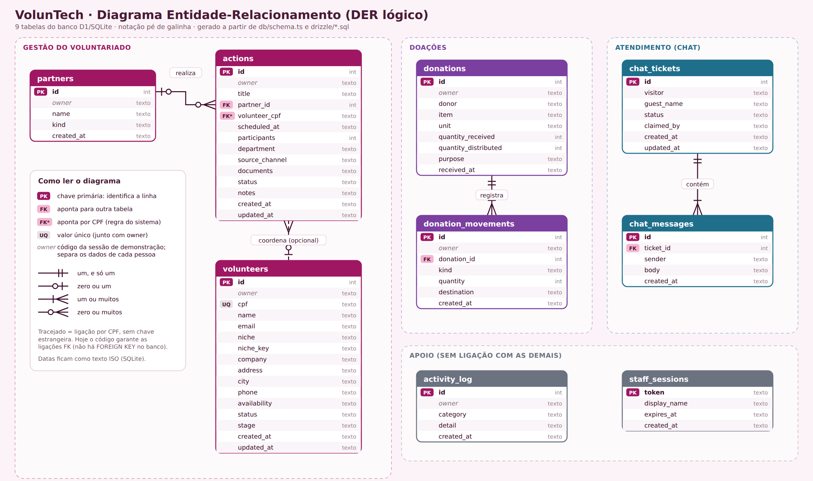

# VolunTech-FAM

**Sistema acadêmico de gestão de voluntariado desenvolvido para a FAM.**

O **VolunTech** foi criado para organizar, em uma única experiência, informações relacionadas a voluntários, ações, instituições parceiras, doações e atendimento ao visitante.

> [!IMPORTANT]
> **Este é um projeto acadêmico e de demonstração.** Os dados exibidos são fictícios. O sistema **não deve ser usado com dados reais de hospital**.

**Versão atual:** `v1.0.2`

---

## Antes de começar: você quer usar ou desenvolver?

| Se você quer... | Vá para |
|---|---|
| **Apenas instalar e usar o VolunTech** | [⬇️ Download](#-download-do-voluntech) |
| **Saber qual arquivo baixar** | [🧭 Qual arquivo devo baixar?](#-qual-arquivo-devo-baixar) |
| **Entender o que aparece no GitHub** | [🧩 Release, Tag e Source code](#-release-tag-e-source-code) |
| **Conhecer as telas do sistema** | [🖥️ Conheça o VolunTech](#️-conheça-o-voluntech) |
| **Executar o projeto como desenvolvedor** | [🧑‍💻 Para desenvolvedores](#-para-desenvolvedores) |

---

# ⬇️ Download do VolunTech

> **Se você só quer testar o sistema, não precisa instalar Node.js, pnpm, VS Code ou Electron.**
>
> Você precisa apenas baixar o instalador correspondente ao seu computador.

### 🪟 Windows

**Baixe:**

```text
VolunTech-Setup-1.0.2.exe
```

Depois:

1. Abra o arquivo `.exe`.
2. Siga o instalador.
3. Ao terminar, abra o **VolunTech** pelo Menu Iniciar ou pelo atalho criado na Área de Trabalho.

**[➡️ Abrir a página de Releases no GitHub](https://github.com/bruno-dsn/VolunTech-FAM/releases/latest)**

---

### 🍎 Mac

No Mac, existem dois tipos de processador que interessam aqui:

| Se em **Sobre Este Mac** aparecer... | Você deve baixar |
|---|---|
| **Chip Apple** | `VolunTech-1.0.2-arm64.dmg` |
| **Processador Intel** | `VolunTech-1.0.2-x64.dmg` |

#### Como descobrir qual Mac você tem

1. Clique no menu **** no canto superior esquerdo.
2. Escolha **Sobre Este Mac**.
3. Procure a informação do processador.

**Apareceu "Chip Apple"?** → use o arquivo **ARM64**.

**Apareceu "Processador Intel"?** → use o arquivo **x64**.

> 💡 Você não precisa saber o que ARM64 ou x64 significa tecnicamente. É apenas uma forma de identificar qual instalador combina com o processador do seu Mac.

**[➡️ Abrir a página de Releases no GitHub](https://github.com/bruno-dsn/VolunTech-FAM/releases/latest)**

---

## 🧭 Qual arquivo devo baixar?

Se você chegou à página de Releases do GitHub e ficou em dúvida, siga esta tabela:

| Seu computador | Arquivo |
|---|---|
| 🪟 **Windows** | `VolunTech-Setup-1.0.2.exe` |
| 🍎 **Mac com Chip Apple** | `VolunTech-1.0.2-arm64.dmg` |
| 🍎 **Mac Intel** | `VolunTech-1.0.2-x64.dmg` |

### Regra simples

```text
WINDOWS
   ↓
.exe
   ↓
Instalar
```

```text
MAC COM CHIP APPLE
   ↓
arm64.dmg
   ↓
Abrir → arrastar para Applications
```

```text
MAC INTEL
   ↓
x64.dmg
   ↓
Abrir → arrastar para Applications
```

### ⚠️ Não sabe o que são ARM64 e x64?

Não tem problema.

- **ARM64** → Mac com **Chip Apple**.
- **x64** → Mac com **processador Intel**.

Você não precisa escolher pela aparência do arquivo. Basta conferir **Sobre Este Mac**.

---

# 🚫 O que NÃO baixar se você só quer usar o sistema

Na página da Release, o GitHub também pode mostrar:

- `Source code (zip)`
- `Source code (tar.gz)`

**Esses arquivos não são os instaladores normais do VolunTech.**

Eles contêm o **código-fonte do projeto** e são destinados principalmente a quem quer estudar, modificar ou desenvolver o sistema.

> ❌ **Não baixe `Source code` para instalar o VolunTech.**
>
> ✅ Para instalar, procure o arquivo do seu sistema: `.exe` no Windows ou `.dmg` no Mac.

<details>
<summary><strong>Mas por que o GitHub mostra "Source code"?</strong></summary>

O GitHub organiza cada versão do projeto em uma página chamada **Release**.

Além dos instaladores preparados para Windows e macOS, o GitHub disponibiliza uma cópia do código-fonte daquela versão.

Isso é normal.

Para quem só quer abrir o programa, a regra é simples:

**Instalador = usar o programa**

**Source code = trabalhar no código**

</details>

---

# 🧩 Release, Tag e Source code

Esses nomes aparecem no GitHub e podem parecer complicados. A diferença é simples.

### 🏷️ Tag

Uma **Tag** é uma identificação de uma versão específica do código.

Por exemplo:

```text
v1.0.2
```

É como colocar uma etiqueta dizendo:

> "Esta é a versão 1.0.2 do projeto."

### 📦 Release

A **Release** é a página do GitHub usada para distribuir uma versão do projeto.

É nela que aparecem os arquivos que podem ser baixados.

Neste projeto, a Release atual é:

**`v1.0.2`**

### 📄 Source code

É o código-fonte daquela versão.

Não é o instalador normal para o usuário final.

<details>
<summary><strong>Resumo em uma frase</strong></summary>

**Tag identifica a versão → Release distribui a versão → Assets são os arquivos disponíveis para baixar.**

</details>

---

# 🛠️ Instalação no Windows

### 1. Baixe o instalador

Na Release `v1.0.2`, procure:

```text
VolunTech-Setup-1.0.2.exe
```

### 2. Abra o instalador

Dê dois cliques no arquivo `.exe` e siga as etapas apresentadas pelo Windows.

### 3. Aviso de segurança do Windows

Como o projeto acadêmico **não possui certificado pago de assinatura**, o Windows pode exibir o SmartScreen.

Se aparecer uma mensagem como **"O Windows protegeu o computador"**:

1. Clique em **Mais informações**.
2. Clique em **Executar assim mesmo**.

### 4. Abra o VolunTech

Depois da instalação, use:

- **Menu Iniciar**, ou
- **Área de Trabalho**.

---

# 🍎 Instalação no Mac

### 1. Descubra seu processador

Vá em:

** → Sobre Este Mac**

Depois escolha:

- **Chip Apple** → `arm64.dmg`
- **Processador Intel** → `x64.dmg`

### 2. Abra o `.dmg`

Dê dois cliques no arquivo baixado.

### 3. Instale

Arraste o **VolunTech** para:

```text
Applications
```

### 4. Primeira abertura

Como o aplicativo acadêmico não é assinado pela Apple, o macOS pode informar que o desenvolvedor não é identificado ou apresentar um aviso de segurança.

Nesse caso:

1. Clique com o botão direito no **VolunTech**.
2. Escolha **Abrir**.
3. Confirme **Abrir**.

Se o macOS continuar bloqueando o aplicativo, existe uma alternativa documentada em [`LEIA-ME-MAC.txt`](LEIA-ME-MAC.txt).

---

# 📱 QR Codes: usar o celular junto com o VolunTech

O VolunTech possui QR Codes na tela inicial.

Eles permitem abrir pelo celular as áreas públicas de demonstração, como:

- **Tirar uma dúvida**
- **Doação simbólica**

### Como funciona?

```text
Computador com VolunTech
          │
          │ mesma rede Wi-Fi
          ▼
       📱 Celular
          │
          ▼
      Escanear QR
```

O endereço usado pelo QR Code é gerado de acordo com o endereço de rede do computador.

### Para funcionar

O computador e o celular precisam estar **na mesma rede Wi-Fi**.

> [!TIP]
> Se o Wi-Fi bloquear a comunicação entre os aparelhos — algo que pode acontecer em redes de visitantes, hotéis ou alguns ambientes acadêmicos — tente usar o **hotspot do celular** ou outra rede.

### O que o celular consegue acessar?

Pelo endereço da rede, o visitante pode acessar as páginas públicas:

- `/duvidas`
- `/gesto`
- o chat do visitante (`/api/chat`)

O **login e o painel de gestão permanecem no computador** que está executando o VolunTech.

Isso foi feito para evitar que a tela de gestão seja exposta acidentalmente na rede local.

> [!NOTE]
> Esse mecanismo é uma proteção de demonstração e **não substitui autenticação institucional ou controles de segurança para um sistema hospitalar real**.

### Firewall

Na primeira abertura, Windows ou macOS pode perguntar se o VolunTech pode receber conexões na rede.

Quando apropriado, permita a conexão na **rede privada/local**.

### O computador mudou de rede?

Feche e abra o VolunTech novamente para que os QR Codes sejam gerados com o novo endereço.

---

# 🔐 Login da demonstração

O projeto utiliza uma conta de demonstração.

Na tela inicial:

- **Nome:** qualquer nome com pelo menos 2 letras
- **Senha:** `VolunTech2026!`

> [!WARNING]
> Essa conta é pública e existe apenas para a demonstração. Ela não protege dados reais.

---

# 🖥️ Conheça o VolunTech

As imagens abaixo mostram a interface real do projeto.

<details open>
<summary><strong>1. Tela inicial e acesso à gestão</strong></summary>

<p align="center">
  
</p>

A tela inicial apresenta o propósito da demonstração, o acesso à gestão e os QR Codes para as áreas públicas.

</details>

<details>
<summary><strong>2. Visão do setor</strong></summary>

<p align="center">
  
</p>

O painel reúne indicadores e informações de acompanhamento em uma visão única.

</details>

<details>
<summary><strong>3. Doações</strong></summary>

<p align="center">
  
</p>

A tela de doações permite acompanhar recebimentos, itens, quantidades, destinos e movimentações da demonstração.

</details>

<details>
<summary><strong>4. Voluntários</strong></summary>

<p align="center">
  
</p>

A área de voluntários organiza os cadastros e informações utilizadas no fluxo de demonstração.

</details>

<details>
<summary><strong>5. Fila de dúvidas</strong></summary>

<p align="center">
  
</p>

A equipe pode acompanhar a fila de atendimento e responder às dúvidas dos visitantes.

</details>

<details>
<summary><strong>6. Sobre o VolunTech</strong></summary>

<p align="center">
  
</p>

A tela apresenta o contexto acadêmico, o problema abordado e a proposta da solução.

</details>

<details>
<summary><strong>7. Laboratório SQL</strong></summary>

<p align="center">
  
</p>

O Laboratório SQL permite praticar consultas sobre dados fictícios e possui verificação automática das etapas do exercício.

</details>

<details>
<summary><strong>8. Material visual adicional</strong></summary>

<p align="center">
  
</p>

Imagem adicional presente no material de referência entregue junto ao projeto.

</details>

---

# 🧪 O que existe na demonstração?

O VolunTech reúne diferentes áreas em uma única aplicação:

| Área | O que apresenta |
|---|---|
| **Visão do setor** | Resumo do funcionamento da demonstração |
| **Ações e agenda** | Acompanhamento de ações e agenda |
| **Instituições e parceiros** | Cadastro e visualização de parceiros |
| **Doações** | Registro e movimentação de doações |
| **Voluntários** | Cadastro e acompanhamento de voluntários |
| **Atualizações de hoje** | Resumo das movimentações da demonstração |
| **Fila de dúvidas** | Atendimento aos visitantes |
| **Canal do visitante** | Página pública sem login para tirar dúvidas |
| **Laboratório SQL** | Exercícios e verificação de consultas |
| **Importar e backup** | Área relacionada ao fluxo de dados da demonstração |
| **Sobre o projeto** | Contexto e proposta acadêmica |

---

# 🤖 IA no desenvolvimento

Ferramentas de IA foram utilizadas como **apoio à engenharia de software**, incluindo análise do projeto, revisão, correção de problemas, configuração de empacotamento e documentação.

As decisões de escopo, validação e apresentação permanecem sob responsabilidade da equipe.

> **Importante:** o **RAG não está implementado nesta versão**. Ele permanece como possibilidade de evolução futura.

---

# 📚 Documentação

A documentação complementar fica em [`DOCUMENTACAO`](DOCUMENTACAO/).

### Documento principal

[`DOCUMENTACAO/VolunTech-Historia-e-Visao-Geral.pdf`](DOCUMENTACAO/VolunTech-Historia-e-Visao-Geral.pdf)

O documento apresenta:

- a história do projeto;
- a dor identificada;
- a solução proposta;
- as funcionalidades;
- as tecnologias;
- a evolução para desktop;
- a participação da IA no desenvolvimento;
- os limites acadêmicos da solução.

### Banco de dados

A pasta [`DOCUMENTACAO/banco-de-dados`](DOCUMENTACAO/banco-de-dados/) contém a documentação do banco, incluindo:

- DER;
- MER;
- tutorial do Laboratório SQL.

[](DOCUMENTACAO/banco-de-dados/)

---

# 🧑‍💻 Para desenvolvedores

> Esta parte é para quem quer executar, estudar ou modificar o projeto.  
> **Se você só quer usar o VolunTech, pode parar aqui.**

## Stack principal

O projeto utiliza:

- **React + TypeScript**
- **Next.js / Vinext**
- **Electron**
- **Cloudflare Workers / Miniflare**
- **D1 / SQLite**
- **Drizzle ORM**
- **Vite**
- **pnpm**
- **GitHub Actions**

---

## Requisitos

O `package.json` define:

```text
Node.js >= 22.13.0
pnpm 11.25.0
```

O projeto utiliza `pnpm` como gerenciador de pacotes.

---

## Instalar as dependências

Dentro da pasta do projeto:

```bash
pnpm install
```

---

## Executar o aplicativo em desenvolvimento

Para abrir o aplicativo desktop em desenvolvimento:

```bash
pnpm electron
```

Também existe o script equivalente:

```bash
pnpm electron:dev
```

### Servidor de desenvolvimento

O comando atual é:

```bash
pnpm dev
```

O `pnpm dev` utiliza:

```text
scripts/electron-server.mjs
```

Esse fluxo é importante porque a detecção do endereço da rede local usada pelos QR Codes passa por esse script.

O endereço pode ser verificado em:

```text
http://localhost:5173/api/network
```

Quando o compartilhamento local está ativo, a resposta deve informar o endereço de rede do computador.

> [!IMPORTANT]
> Não substitua o `pnpm dev` pelo fluxo antigo de execução direta do framework. A versão `v1.0.2` corrigiu justamente o fluxo relacionado ao QR Code e à rede local.

---

## Scripts disponíveis

Os scripts abaixo estão definidos no `package.json`:

| Comando | Finalidade |
|---|---|
| `pnpm dev` | Executa o servidor de desenvolvimento pelo fluxo atual |
| `pnpm build` | Gera o build da aplicação |
| `pnpm start` | Executa o servidor local a partir do build |
| `pnpm electron` | Abre o aplicativo desktop |
| `pnpm electron:dev` | Abre o aplicativo desktop em desenvolvimento |
| `pnpm electron:build` | Faz build e empacota com Electron Builder |
| `pnpm lint` | Executa o ESLint |
| `pnpm db:generate` | Gera migrações com Drizzle |
| `pnpm dist:win` | Gera o instalador Windows |
| `pnpm dist:mac` | Gera o instalador macOS |
| `pnpm dist` | Gera a distribuição usando Electron Builder |

---

## Estrutura principal

A estrutura abaixo resume as áreas mais importantes do projeto:

```text
VolunTech-FAM/
├── app/                    # Rotas e páginas da aplicação
├── components/voluntech/   # Componentes principais da interface
├── db/                     # Schema e acesso ao banco
├── drizzle/                # Migrações do banco
├── lib/                    # Lógica compartilhada
├── public/                 # Arquivos públicos
├── scripts/                # Scripts de desenvolvimento e execução
├── build/                  # Configuração e arquivos do build
├── vendor/                 # Dependências/arquivos de suporte do projeto
├── DOCUMENTACAO/           # Documentação acadêmica e banco
├── main.js                 # Processo principal do Electron
├── package.json            # Dependências e scripts
├── pnpm-lock.yaml          # Lockfile das dependências
├── vite.config.ts          # Configuração do Vite/Vinext
├── drizzle.config.ts       # Configuração do Drizzle
├── CHANGELOG.md            # Histórico de alterações
└── README.md               # Esta documentação
```

### Como o desktop funciona?

O Electron inicia um **servidor interno separado**.

De forma simplificada:

```text
VolunTech
   │
   └── Electron
         │
         └── servidor interno
               │
               ├── interface
               ├── API
               └── banco local
```

O estado gravável do runtime fica fora do código principal do aplicativo, no diretório de dados do usuário.

No empacotamento, os arquivos necessários do servidor e as dependências Node são preparados fora do ASAR para evitar problemas de resolução de módulos e diretório de execução.

---

# 🗄️ Banco de dados

O projeto utiliza:

- **SQLite / D1**
- **Drizzle ORM**
- migrações armazenadas em `drizzle/`

O schema principal fica em:

```text
db/schema.ts
```

As migrações ficam em:

```text
drizzle/
```

A aplicação aplica as migrações necessárias antes de utilizar o banco local.

---

# 🌐 QR Codes e variáveis de ambiente

Existem algumas configurações opcionais:

| Variável | Efeito |
|---|---|
| `VOLUNTECH_LAN=0` | Mantém o aplicativo somente neste computador e desliga o compartilhamento pelos QR Codes |
| `VOLUNTECH_PUBLIC_URL=https://...` | Define manualmente o endereço utilizado nos QR Codes |
| `VOLUNTECH_PORT=5173` | Define a porta do servidor interno |

A porta padrão é:

```text
5173
```

Se ela já estiver sendo utilizada por outro programa, o VolunTech informa o problema em vez de abrir outro serviço nessa porta.

---

# 📦 Gerar instaladores localmente

### Windows

No Windows:

```bash
pnpm dist:win
```

### macOS

No macOS:

```bash
pnpm dist:mac
```

Os comandos utilizam o Electron Builder.

Os arquivos de distribuição são gerados na pasta:

```text
release/
```

---

# 🚀 Publicar uma nova Release

A publicação oficial dos instaladores é feita pelo **GitHub Actions**.

O workflow está em:

```text
.github/workflows/build-desktop.yml
```

Ele é acionado:

- manualmente pelo `workflow_dispatch`; ou
- quando uma tag que começa com `v` é enviada ao GitHub.

Exemplo:

```bash
git tag v1.0.2
git push origin v1.0.2
```

O workflow gera:

- instalador Windows;
- instalador macOS ARM64;
- instalador macOS x64;

e publica os instaladores nas Releases quando executado a partir de uma tag.

<details>
<summary><strong>Também é possível executar o workflow manualmente</strong></summary>

No GitHub:

```text
Actions
  ↓
Build desktop installers
  ↓
Run workflow
```

Nesse caso, os arquivos ficam como **artifacts** da execução.

</details>

---

# ✅ Verificações antes de publicar

Antes de publicar alterações, o projeto possui as seguintes verificações:

```bash
pnpm lint
pnpm exec tsc --noEmit
pnpm build
```

Com o aplicativo em execução (`pnpm start` ou `pnpm dev`), também existe o teste:

```bash
node --experimental-strip-types --no-warnings scripts/test-sql-lab.mjs
```

---

# 📝 Histórico da versão atual

## `v1.0.2`

Principais correções:

- correção do QR Code que podia aparecer como **"Sem rede"**;
- correção da inicialização do servidor de desenvolvimento;
- correção do endpoint `/api/network`;
- QR Codes dinâmicos;
- ajuste do `pnpm dev`;
- atualização da documentação relacionada.

## `v1.0.1`

Correção relacionada à publicação dos instaladores desktop.

## `v1.0.0`

Primeira versão do VolunTech-FAM.

Para o histórico detalhado, consulte [`CHANGELOG.md`](CHANGELOG.md).

---

# 🔎 Arquivos úteis para quem mantém o projeto

| Arquivo | Para que serve |
|---|---|
| [`package.json`](package.json) | Dependências, scripts e configuração de empacotamento |
| [`CHANGELOG.md`](CHANGELOG.md) | Histórico de alterações |
| [`LEIA-ME-WINDOWS.txt`](LEIA-ME-WINDOWS.txt) | Orientações específicas para Windows |
| [`LEIA-ME-MAC.txt`](LEIA-ME-MAC.txt) | Orientações específicas para macOS |
| [`main.js`](main.js) | Processo principal do Electron |
| [`scripts/electron-server.mjs`](scripts/electron-server.mjs) | Inicialização do servidor usado pelo desktop e pelo desenvolvimento |
| [`db/schema.ts`](db/schema.ts) | Schema do banco |
| [`.github/workflows/build-desktop.yml`](.github/workflows/build-desktop.yml) | Automação de geração/publicação dos instaladores |

---

# ⚠️ Limites da demonstração

O VolunTech é um **projeto acadêmico**.

Os dados apresentados são fictícios e o sistema não deve ser tratado como uma solução pronta para operação hospitalar real.

Para um ambiente real seriam necessários, entre outros pontos:

- autenticação institucional;
- controle de perfis e permissões;
- auditoria;
- políticas de retenção;
- revisão jurídica;
- adequação à LGPD;
- validação dos fluxos com a instituição;
- controles de segurança apropriados.

---

# 🔗 Links

- **[Repositório no GitHub](https://github.com/bruno-dsn/VolunTech-FAM)**
- **[Releases / Downloads](https://github.com/bruno-dsn/VolunTech-FAM/releases)**
- **[Release atual — v1.0.2](https://github.com/bruno-dsn/VolunTech-FAM/releases/tag/v1.0.2)**

---

<p align="center">
  <strong>VolunTech-FAM</strong><br>
  Projeto acadêmico · FAM
</p>
